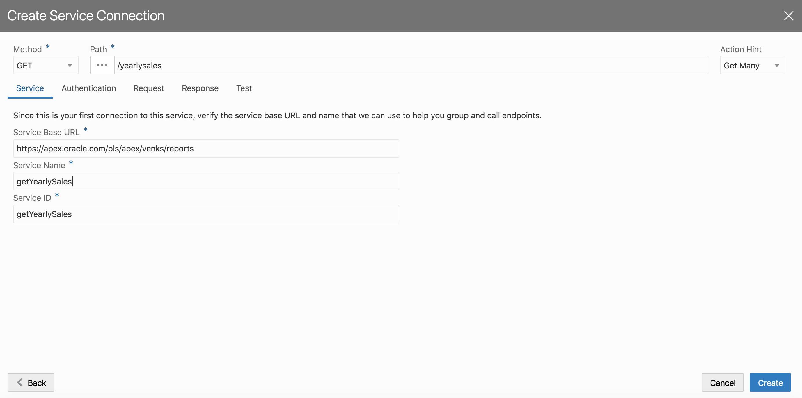
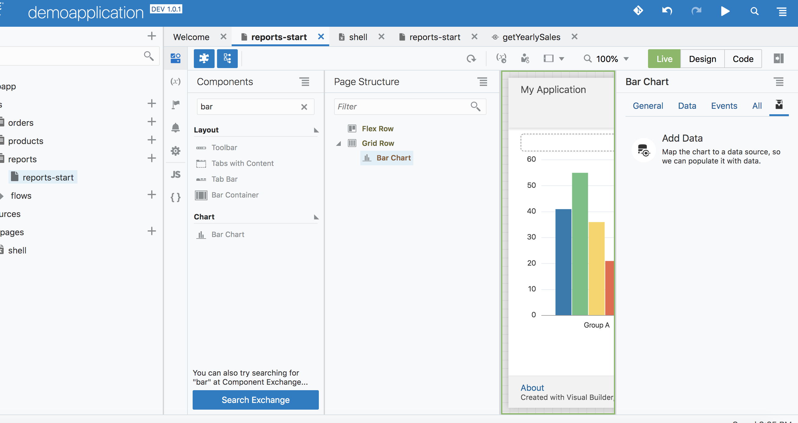
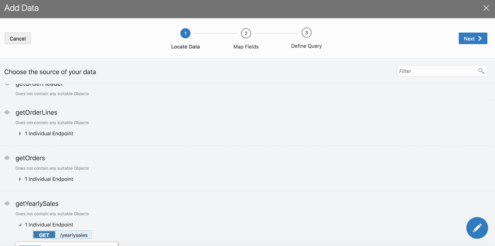
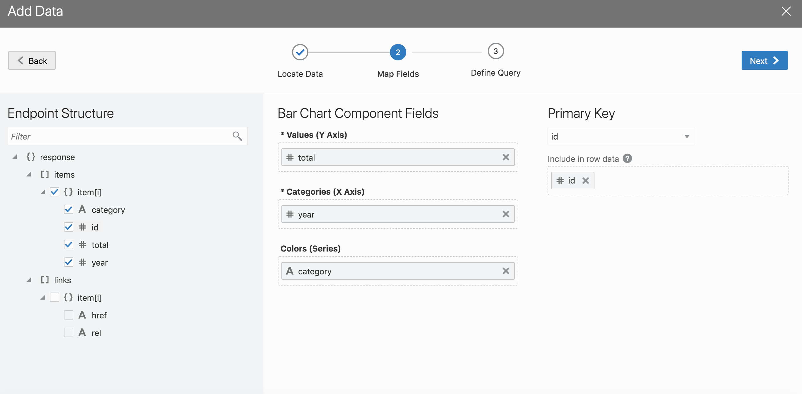
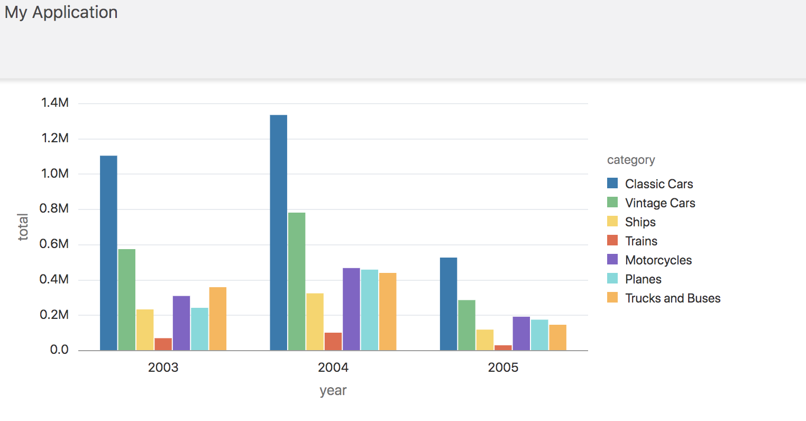
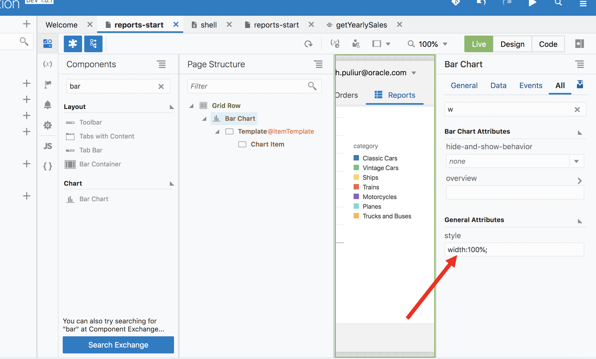
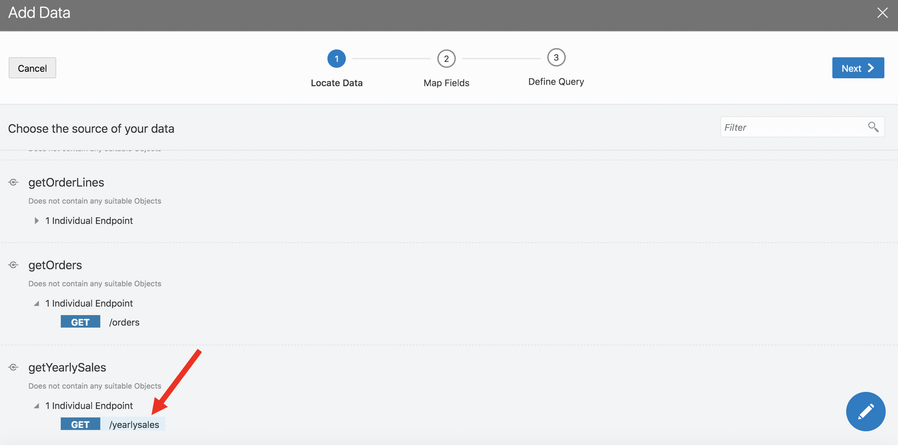
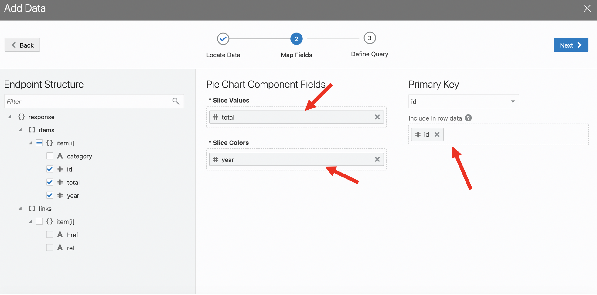
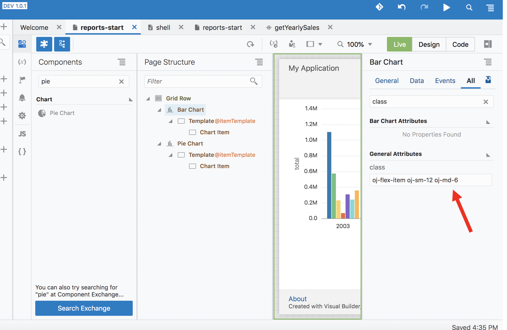

## Table of contents

* TOC
{:toc}

# Introduction

In this lab we will be adding some charts to the reports page and learn about the visualization capabilities of Visual Builder. We will be consuming data from a remote rest endpoint. 

**Add a bar chart visualizing annual sales**

#### Step 1 : Create a service connection to remote rest endpoint**

https://apex.oracle.com/pls/apex/venks/reports/yearlysales

#### Step 2: Make sure that you hit the test tab and copy the response body before clicking create.

#### Step 3: Drag and Drop a bar chart to the reports page

#### Step 4: Click on add data and choose the service connection we just defined in step 1

Ensure that you choose all the fields. Map the Value(Y Axis) to total field, Label(X axis) to year 

#### Step 5: Now you should have a bar chart on the reports page

#### Step 6: Set the width to 100%, so the chart takes the full width of the container

## Add a pie chart to display total sales by category**

#### Step 1: Drag and drop a pie chart from the components to the page

#### Step 2: Now we will reference the service connection defined before as source of data for the pie chart

#### Step 3: Check the rendered Pie Chart

Next we want to ensure both the chart are same width and take up 6 columns in a 12 grid layout

#### Step 4: Change the class for both the chart to oj-md-6

Now both the charts should be of the same width and properly aligned on the screen

## Chart options**

There are several configuration options available for the charts. You can declaratively set some of those via property palette.

Refer to the image below to see how they change the rendering of the chart.

Congratulations, you have completed lab 3. [Click here to goto Lab 4](lab4)